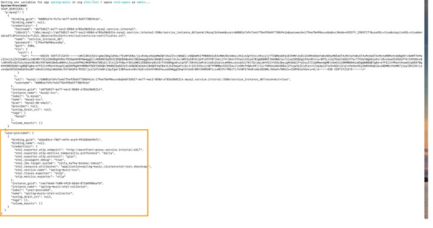
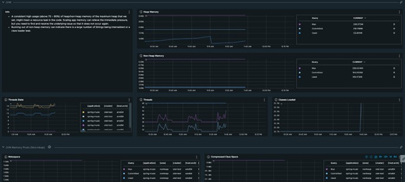
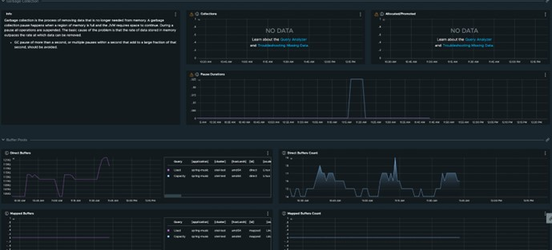
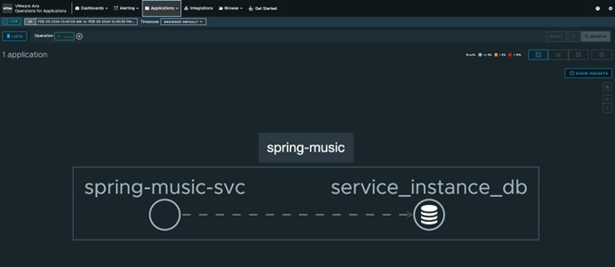
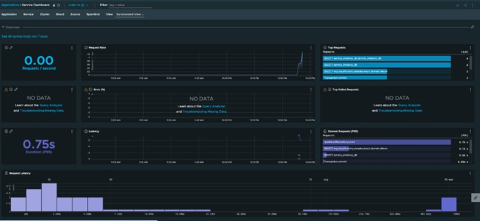
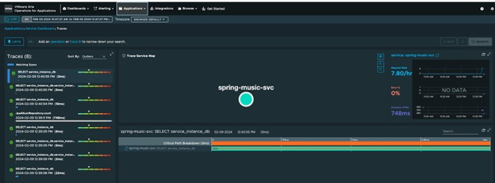

# Instrumenting TAS OpenTelemetry for Spring Boot Application with Tanzu Observability or Wavefront 

The OpenTelemetry (OTel) agent for Java based Spring Boot application enables JMX profiling, tracing, eventing on any Java 8+ application, and dynamically injects bytecode to capture telemetry from a number of popular libraries and frameworks. This provides the ability to gather telemetry data from a Java application without code changes.
The OpenTelemetry Java agent uses `OTLP` exporter configured to send data to OpenTelemetry collector

For this demonstration, we've enabled the Spring Micrometer traces for a sample Spring Boot application through the OpenTelemetry Java agent that is available with the latest [Java buildpack](https://github.com/cloudfoundry/java-buildpack.git) `v4.66.0`.

Before using the buildpack to fetch the metrics, we must enable OpenTelemetry Collector agent on TAS under the Wavefront Nozzle tile settings.


## Configure OTel on Tanzu Observability by Wavefront Nozzle

In this section, we'll configure OTel on Tanzu Observability (TO) by configuraing few parameters in TAS for the Wavefront tile.

1. On TAS for Wavefront tile, add the below settings in the `Config` section under **Wavefront Proxy Config** > **Custom Proxy Configuration** > **Custom**.
    ```bash
    otlpGrpcListenerPorts=4317
    otlpHttpListenerPorts=4318
    otlpResourceAttrsOnMetricsIncluded=true
    ```
1. Add a pre-processing rule under the `Preprocessor Rules` section under **Wavefront Proxy Config** > **Custom Proxy Configuration** > **Custom**.
    ```bash
    '4317':
    - rule    : drop_process_command
        action  : dropTag
        tag     : process.command_args
    ```

    
1.	Save the changes and click **Apply**.
</br>For more information about the parameter references, see the following documents:
    - https://opentelemetry.io/docs/languages/java/automatic/
    - https://opentelemetry.io/docs/languages/java/automatic/spring-boot/


## Deploy a Sample Spring Boot Application and Create the Service for Otel-Collector

In the next step, we'll create a Spring Boot application with the java-buildpack (v4.66.0) that has the open-telemetry JAVA agent.

> **Note** We've used TAS 5.0.4 for this demonstration purpsoe.

The spring-music app is cloned from https://github.com/cloudfoundry-samples/spring-music in the jumpbox.  

1. Clone the spring-music app from [Github](https://github.com/cloudfoundry-samples/spring-music) to jumpbox.

1. Go to the spring-music directory and run the following command:
    ```bash
    $ cf push spring-music -f manifest.yml -b https://github.com/cloudfoundry/java-buildpack.git
    ```
1. To check the application status, run the following command:
    ```bash
    $ cf app spring-music       
    Showing health and status for app spring-music in org otel-test / space otel-space as admin...
    name:              spring-music
    requested state:   started
    routes:            spring-music-agile-baboon-rr.apps.h2o-2-22348.h2o.vmware.com
    last uploaded:     Fri 02 Feb 12:23:31 IST 2024
    stack:             cflinuxfs4
    buildpacks:        
        name                                                 version                                                              detect output   buildpack name
        https://github.com/cloudfoundry/java-buildpack.git   9e8f9be-https://github.com/cloudfoundry/java-buildpack.git#9e8f9be   java            java
    type:           web
    sidecars:       
    instances:      1/1
    memory usage:   1024M
        state     since                  cpu    memory         disk           logging        details
    #0   running   2024-02-06T09:31:09Z   0.6%   422.9M of 1G   320.3M of 1G   0/s of 16K/s   
    type:           task
    sidecars:       
    instances:      0/0
    memory usage:   1024M
    There are no running instances of this process.
    ```
1. Create a user-provided service for the spring-music app and bind to it.
    ```bash
    $ cf cups spring-music-otel-collector -p '{"otel.exporter.otlp.endpoint":"http://wavefront-proxy.service.internal:4317","otel.exporter.otlp.metrics.temporality.preference":"delta","otel.resource.attributes":"application=spring-music,cluster=otel-test,shard=ap1","otel.traces.exporter":"otlp","otlp.metrics.exporter":"otlp","otel.exporter.otlp.protocol":"grpc","otel.service.name":"spring-music-svc","otel.jmx.target.system":"jetty,kafka-broker,tomcat","otel.javaagent.debug":"true"}'
    ```
1. Bind the service to the spring-music app and restage the app.
    ```bash
    $ cf bind-service spring-music spring-music-otel-collector  && cf restage spring-music

    $ cf service spring-music-otel-collector
    Showing info of service spring-music-otel-collector in org otel-test / space otel-space as admin...
    name:                spring-music-otel-collector
    guid:                c6e74b4b-7680-4915-b56d-87268988aafd
    type:                user-provided
    tags:                
    route service url:   
    syslog drain url:    
    Showing status of last operation:
    status:    create succeeded
    message:   Operation succeeded
    started:   2024-02-02T06:52:23Z
    updated:   2024-02-02T06:52:23Z
    Showing bound apps:
    name           binding name   status             message
    spring-music                  create succeeded   
    ```
    


## Observing the Metrics in VMware Aria for Operations (Tanzu Observability)

For Spring micrometer traces for the application, the data is populated in the Spring Boot dashboard under the Tanzu Observability portal.


**JVM Utilization**:



**Garbage collection and Buffer pools**:



**JDBC connections**:


The telemetry data further enriches to provide tracing information, services call, operational tasks, and latency between the classes and system calls:








## Conclusion

- The current implementation helps in getting Spring Boot application tracing to TO tile from TAS through the wavefront proxy as existing TAS firehose doesn’t allow existing tracing metrics from the platform.
- Using Open Telemetry Javaagent in the buildpack, the user can auto instrument most of the data required from the Spring Boot application without configuring them manually.
